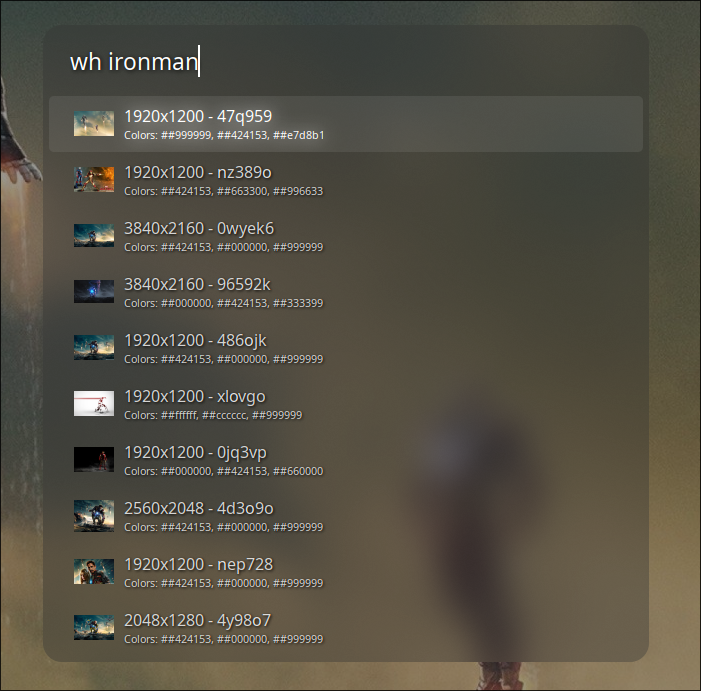

# Wallhaven ULauncher Extension

> Search and apply beautiful wallpapers from Wallhaven directly within ULauncher

[](https://ulauncher.io/)
[](https://opensource.org/licenses/MIT)
[](https://www.anthropic.com/claude)

## ⚠️ AI-Generated Code Notice

This project was primarily written using AI assistance (Claude by Anthropic). While functional and tested, users should review the code before use and report any issues. Contributions and improvements from the community are especially welcome.

## Features

- 🔍 **Search Wallhaven directly from ULauncher** - No need to open a browser
- 📐 **Automatic screen resolution detection** - Uses `hyprctl` for Hyprland users
- 🖼️ **Thumbnail previews** - See resolution and dominant color information
- ⚡ **One-click application** - Download and apply wallpapers instantly
- ⚙️ **Configurable search parameters** - Customize result limits and minimum resolution
- 💾 **Intelligent thumbnail caching** - Faster browsing with cached previews

## Screenshots



*Extension in action: Searching for "ironman" wallpapers with thumbnail previews, resolutions, and dominant color information*

## Requirements

- **ULauncher** v5.0+ (API v2.0)
- **Python** 3.x (included with ULauncher)
- **`change-wallpaper` script** in your `$PATH` ⚠️ **REQUIRED** (see installation instructions below)
- **`hyprctl`** (optional, for automatic resolution detection on Hyprland)

## Installation

### 1. Install the Extension

Clone this repository into your ULauncher extensions directory:

```bash
git clone https://github.com/emad-elsaid/ulauncher-wallhaven.git ~/.local/share/ulauncher/extensions/ulauncher-wallhaven
```

Then restart ULauncher or add the extension via **ULauncher Preferences → Extensions → Add extension**.

### 2. Create the `change-wallpaper` Script

**This step is mandatory.** The extension requires a `change-wallpaper` script in your `$PATH` to apply wallpapers. Choose the appropriate example for your window manager/compositor:

#### Hyprland

```bash
#!/bin/bash
# Save as ~/bin/change-wallpaper (or anywhere in PATH)
# Make executable: chmod +x ~/bin/change-wallpaper

WALLPAPER="$1"
hyprctl hyprpaper preload "$WALLPAPER"
hyprctl hyprpaper wallpaper ",$WALLPAPER"
```

#### Sway

```bash
#!/bin/bash
swaymsg output "*" bg "$1" fill
```

#### i3 (with feh)

```bash
#!/bin/bash
feh --bg-fill "$1"
```

#### GNOME

```bash
#!/bin/bash
gsettings set org.gnome.desktop.background picture-uri "file://$1"
gsettings set org.gnome.desktop.background picture-uri-dark "file://$1"
```

#### KDE Plasma

```bash
#!/bin/bash
qdbus org.kde.plasmashell /PlasmaShell org.kde.PlasmaShell.evaluateScript "
var allDesktops = desktops();
for (i=0;i<allDesktops.length;i++) {
    d = allDesktops[i];
    d.wallpaperPlugin = 'org.kde.image';
    d.currentConfigGroup = Array('Wallpaper', 'org.kde.image', 'General');
    d.writeConfig('Image', 'file://$1');
}"
```

**After creating the script:**

```bash
# Make it executable
chmod +x ~/bin/change-wallpaper

# Ensure ~/bin is in your PATH (add to ~/.bashrc or ~/.zshrc if needed)
export PATH="$HOME/bin:$PATH"
```

## Usage

1. **Activate ULauncher** (default: `Ctrl+Space` or `Alt+Space`)
2. **Type the keyword** (default: `wh`) followed by your search query
   - Example: `wh nature sunset`
3. **Browse results** with arrow keys
4. **Press Enter** to download and apply the wallpaper
5. Wallpaper will be saved to `~/Pictures/[wallpaper-id].jpg`

## Configuration

Configure the extension via **ULauncher Preferences → Extensions → Wallhaven Wallpaper Search**:

| Setting | Description | Options | Default |
|---------|-------------|---------|---------|
| **keyword** | Activation keyword | Any string | `wh` |
| **results_limit** | Number of results to display | 5, 10, 15, 20 | `10` |
| **min_resolution** | Minimum wallpaper resolution | `auto`, `1920x1080`, `2560x1440`, `none` | `auto` |

**Resolution Filtering:**
- `auto` - Uses your detected screen resolution (Hyprland only, via `hyprctl`)
- `1920x1080` - Full HD minimum
- `2560x1440` - QHD minimum
- `none` - No filtering (all resolutions)

## How It Works

1. **API Integration** - Queries the Wallhaven API v1 (anonymous, no API key required)
2. **Resolution Detection** - Detects screen resolution using `hyprctl` or defaults to 1920x1080
3. **Thumbnail Caching** - Stores thumbnails in `~/.cache/ulauncher_wallhaven` for improved performance
4. **Wallpaper Download** - Downloads full-resolution images to `~/Pictures/`
5. **Application** - Executes the `change-wallpaper` command to apply the wallpaper

## Troubleshooting

### "change-wallpaper: command not found"

The `change-wallpaper` script is not in your `$PATH` or is not executable.

**Solution:**
1. Verify the script exists: `which change-wallpaper`
2. Make it executable: `chmod +x /path/to/change-wallpaper`
3. Ensure its directory is in `$PATH`: `echo $PATH`

### Resolution detection fails

If you're not using Hyprland, automatic resolution detection won't work.

**Solution:**
- Set `min_resolution` to a specific value (`1920x1080`, `2560x1440`) or `none` in extension preferences

### No results appear

Network or API issues may prevent results from loading.

**Solution:**
1. Check your internet connection
2. Verify Wallhaven.cc is accessible: `curl https://wallhaven.cc/api/v1/search`
3. Check ULauncher logs for errors

### Wallpaper doesn't apply

The `change-wallpaper` script may not be compatible with your setup.

**Solution:**
1. Test the script manually: `change-wallpaper /path/to/test-image.jpg`
2. Verify it works with your window manager/compositor
3. Check the script's permissions and syntax

## Contributing

Contributions are welcome! This project was AI-generated, so community improvements are especially appreciated.

**How to contribute:**
- 🐛 **Report bugs** via [GitHub Issues](https://github.com/emad-elsaid/ulauncher-wallhaven/issues)
- 💡 **Request features** via [GitHub Issues](https://github.com/emad-elsaid/ulauncher-wallhaven/issues)
- 🔧 **Submit pull requests** - Please test thoroughly before submitting

## License

This project is licensed under the MIT License - see the [LICENSE](LICENSE) file for details.

## Acknowledgments

- [Wallhaven.cc](https://wallhaven.cc/) - For the excellent wallpaper API
- [ULauncher](https://ulauncher.io/) - For the amazing application launcher
- [Claude by Anthropic](https://www.anthropic.com/claude) - For AI assistance in creating this extension

---

**Enjoy your new wallpapers! ⭐ Star this repo if you find it useful!**
